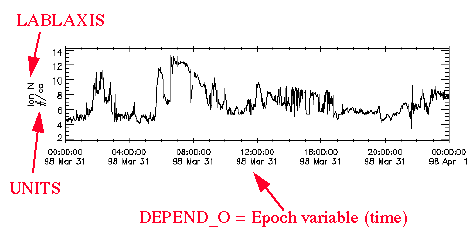

# Variable Examples

## Data Variables

### Example of Scalar Density Variable


The example demonstrates a scalar **_data_** variable `SW_P_Den` displayed in [CDAWeb](https://cdaweb.gsfc.nasa.gov/) as a time series (`DISPLAY_TYPE = "time_series"`) and its corresponding definition as it appears in a CDF Skeleton table. All required and some recommended variable attributes are defined. On the plot, the y-axis labels come from variable attributes `LABLAXIS` and `UNITS`. The x-axis is defined by the **_support_data_** variable `Epoch` (time, [see examples here](#examples-of-epoch-variables)), which is attached to `SW_P_Den` via the `DEPEND_0` attribute. Since `SW_P_Den` is a 0-dimensional variable, it does not require any other `DEPEND_i` attributes.

<p align="left">
    
</p>


```
! Variable       Data       Number                       Record      Dimension
! Name           Type       Elements    Dims    Sizes    Variance    Variances
! --------       ----       --------    ----    -----    --------    ---------

"SW_P_Den"     CDF_REAL4       1         0                  T

! Attribute       Data
! Name            Type            Value
! --------        ----            -----

 "CATDESC"       CDF_CHAR       { "Ion number density (Solar Wind " -
                                  "Analyzer), scalar" }
 "DEPEND_0"      CDF_CHAR       { "Epoch" }
 "DICT_KEY"      CDF_CHAR       { "density>ion_number" }
 "DISPLAY_TYPE"  CDF_CHAR       { "time_series" }
 "FIELDNAM"      CDF_CHAR       { "Ion Number Density (CPI/SWA)" }
 "FILLVAL"       CDF_REAL4      { -1.0e+31 }
 "FORMAT"        CDF_CHAR       { "f8.3" }
 "LABLAXIS"      CDF_CHAR       { "Ion N" }
 "UNITS"         CDF_CHAR       { "#/cc" }
 "VALIDMIN"      CDF_REAL4      { 0.01 }
 "VALIDMAX"      CDF_REAL4      { 1000.0 }
 "VAR_NOTES"     CDF_CHAR       { "Assuming no helium (0.3 - several " - 
                                  "hundred) if the density is less than " -
                                  "0.3/cc the higher moments (VEL,TEMP) " - 
                                  "shall not be used because of the poor " - 
                                  "counting statistics." }

 "VAR_TYPE"      CDF_CHAR       { "data" }.
```


### Example of Vector Magnetic Field Variable

**_data_** variable `BGSE` (Vector Magnetic Field) is displayed as time series plots, one for each vector component (`DISPLAY_TYPE = "time_series"`). The vector variable does not need a `DEPEND_1` attribute since it does not depend on any additional numerical data. The x-axis is defined by the **_support_data_** variable `Epoch` (time) attached via `DEPEND_0` attribute. The y-axis labels come from two places: (1) `"Bx GSE"`, `"By GSE"`, `"Bz GSE"` array of strings (labeled in blue) from the **_metadata_** variable `label_B_GSE` ([described here](#example-of-magnetic-field-label-variable)) which is attached to `BGSE` via the `LABL_PTR_1` attribute and (2) `nT` from the `UNITS` attribute. Note that if each vector component requires distinct unit or format string, instead of using `UNITS` and `FORMAT` attributes, the string arrays must be provided in separate **_metadata_** variables attached to the **_data_** variable via `UNIT_PTR` and `FORM_PTR` attributes. 

<p align="left">
    
</p>


```
! Variable       Data       Number                       Record      Dimension
! Name           Type       Elements    Dims    Sizes    Variance    Variances
! --------       ----       --------    ----    -----    --------    ---------

"BGSE"         CDF_REAL4       1         1        3         T           T

! Attribute       Data
! Name            Type           Value
! --------        ----           -----

 "FIELDNAM"      CDF_CHAR      { "B field in GSE coordinates (1 min)" }
 "VALIDMIN"      CDF_REAL4     { -65534.0 }
 "VALIDMAX"      CDF_REAL4     { 65534.0 }
 "UNITS"         CDF_CHAR      { "nT" }
 "DISPLAY_TYPE"  CDF_CHAR      { "time_series" }
 "FORMAT"        CDF_CHAR      { "E13.6" }
 "SCALETYP"      CDF_CHAR      { "linear" }
 "CATDESC"       CDF_CHAR      { "Magnetic field vector in GSE" - 
                                 "cartesian coordinates (1 min)" }
 "FILLVAL"       CDF_REAL4     { -1.0e+31 }
 "LABL_PTR_1"    CDF_CHAR      { "label_B_GSE" }
 "DEPEND_0"      CDF_CHAR      { "Epoch" }
 "VAR_TYPE"      CDF_CHAR      { "data" }.

```
### Example of 1-D Flux Variable

A 1-D **_data_** variable `IDiffI_I` (Ion Diff. Intensity at 12 energies) is displayed as a spectrogram (`DISPLAY_TYPE = "spectrogram"`). The z-axis labels come from variable attributes `LABLAXIS` and `UNITS`. The y-axis labels (labeled in green) come from the  energy variable `IDiffI_I_Energy` (**_support_data_**, [described here](#example-of-1-d-energy-variable)) attached to `IDiffI_I` via the `DEPEND_1` attribute, specifically the `LABLAXIS` (or `FIELDNAM`) and `UNITS` of the energy variable. The x-axis if defined by the **_support_data_** variable `Epoch` (time) attached via `DEPEND_0` attribute.

<p align="left">
    
</p>


```
! Variable       Data       Number                       Record      Dimension
! Name           Type       Elements    Dims    Sizes    Variance    Variances
! --------       ----       --------    ----    -----    --------    ---------

 "IDiffI_I"    CDF_REAL4       1         1       12         T            T

! Attribute          Data
! Name               Type            Value
! --------           ----            -----

 "FIELDNAM"         CDF_CHAR       { "Spin-avg Ion Diff Inten (EPIC/ICS)" }
 "CATDESC"          CDF_CHAR       { "Ion Diff. Intensity, at 12 energies " - 
                                     "67-1361 keV (EPIC/ICS)" }
 "VALIDMIN"         CDF_REAL4      { 1.000000e-04 }
 "VALIDMAX"         CDF_REAL4      { 1.000000e+10 }
 "SCALETYP"         CDF_CHAR       { "log" }
 "UNITS"            CDF_CHAR       { "1/[cm**2-s-sr-keV]" }
 "LABLAXIS"         CDF_CHAR       { "dJ/dE" }
 "FORMAT"           CDF_CHAR       { "E9.3" }
 "DEPEND_0"         CDF_CHAR       { "Epoch" }
 "DEPEND_1"         CDF_CHAR       { "IDiffI_I_Energy" }
 "DELTA_PLUS_VAR"   CDF_CHAR       { "IDiffI_I_Uncert" }
 "DELTA_MINUS_VAR"  CDF_CHAR       { "IDiffI_I_Uncert" }
 "DICT_KEY"         CDF_CHAR       { "particle_flux>ion_differential" }
 "VAR_TYPE"         CDF_CHAR       { "data" }
 "FILLVAL"          CDF_REAL4      { -1.000000e+31 }
 "DISPLAY_TYPE"     CDF_CHAR       { "spectrogram" } .

```

As an alternative to spectrogram, stack plot (`DISPLAY_TYPE = "stack_plot"`) also displays all 1-D data on a single plot. The following plot shows Electron Flux variable at 7 energies displayed as a stack plot. As opposed to spectrogram, the y-axis labels come from variable attributes `LABLAXIS` and `UNITS`. The z-axis labels (labeled in green) come from the energy variable attached to the Electron Flux variable via the `DEPEND_1` attribute, specifically the `LABLAXIS` (or `FIELDNAM`) and `UNITS` of the energy variable. The x-axis is defined by the **_support_data_** variable `Epoch` (time) attached via `DEPEND_0` attribute.

<p align="left">
    
</p>


### Example of 2-D Flux Variable

The following 2-D (sizes 28,12) **_data_** variable `Flux_H` (H+ number flux) depends on **_support_data_** variables `energy` (first dimension) and `angle` (second dimension). **There are two ways to plot spectrograms with these 2-D data**:
- plot all energies (y-axis) and a few selected angle bins (in separate panels)
- plot all angles (y-axis) and a few selected energy bins (in separate panels).

These are both illustrated below. `Flux_H` needs two label variables to adequately label all possible spectrogram displays. `LABL_PTR_1` points to a label (**_metadata_**) 1-D variable `H_energy_of_flux` of size 28; the label variable holds 28 H+ energy labels, e.g., `"H+ Flux 4.4keV/e"`. `LABL_PTR_2` points to a label (**_metadata_**) 1-D variable `H_angle_of_flux` of size 12; the label variable holds 12 H+ angle labels, e.g., `"H+ Flux 7.5 deg"`.

#### H+ number flux for 28 energies and 3 selected angle bins

The three selected angle bins appear as separate panels. The `energy` (**_support_data_**) variable attribute values (either the `LABLAXIS` value or the `FIELDNAM` value, along with the `UNITS` value) are used to label the y-axis on each panel. The `energy` variable is attached to the `Flux_H` (**_data_**) variable  via the `DEPEND_1` attribute.

The z-axis (color bar) is labeled with selected values from the H+ angle label variable `H_angle_of_flux` (**_metadata_**) that is attached to the **_data_** variable via the `LABL_PTR_2` attribute. The z-axis units come from the `Flux_H` (**_data_**) variable `UNITS` attributes.


<p align="left">
    
</p>


```
! Variable       Data       Number                       Record      Dimension
! Name           Type       Elements    Dims    Sizes    Variance    Variances
! --------       ----       --------    ----    -----    --------    ---------

 "Flux_H"      CDF_REAL4       1         2      28 12       T           T T

! Attribute            Data
! Name                 Type            Value
! --------             ----            -----

 "FIELDNAM"           CDF_CHAR       { "H+ number flux" }
 "VALIDMAX"           CDF_REAL4      { 1.0e+08 }
 "UNITS"              CDF_CHAR       { "#/(cm^2-s-keV/e-sr)" }
 "FORMAT"             CDF_CHAR       { "e12.4" }
 "LABL_PTR_1"         CDF_CHAR       { "H_energy_of_flux" }
 "LABL_PTR_2"         CDF_CHAR       { "H_angle_of_flux" }
 "MONOTON"            CDF_CHAR       { "FALSE " }
 "FILLVAL"            CDF_REAL4      { -1.0e+31 }
 "CATDESC"            CDF_CHAR       { "H+ number flux for for 28 energy and " - 
                                       "3 selected angle bins." }
 "VAR_TYPE"           CDF_CHAR       { "data" }
 "DICT_KEY"           CDF_CHAR       { "particle_flux>number_species_proton" }
 "DEPEND_0"           CDF_CHAR       { "Epoch_H" }
 "DEPEND_1"           CDF_CHAR       { "energy" }
 "DEPEND_2"           CDF_CHAR       { "angle" }
 "AVG_TYPE"           CDF_CHAR       { "standard" }
 "DISPLAY_TYPE"       CDF_CHAR       { "spectrogram>y=energy,z=Flux_H(*,1),z=" -  
                                       "Flux_H(*,7),z=Flux_H(*,12)" }
 "SCALETYP"           CDF_CHAR       { "log" }
 "VAR_NOTES"          CDF_CHAR       { "Negative values reflect low counting " - 
                                       "rates and background subtraction. " } .

```

#### H+ number flux for 12 angles and 3 selected energy bins

The three selected energy bins appear as separate panels. The `angle` (**_support_data_**) variable attribute values (either the `LABLAXIS` value or the `FIELDNAM` value, along with the `UNITS` value) are used to label the y-axis on each panel. The `angle` variable is attached to the `Flux_H` (**_data_**) variable via the `DEPEND_2` attribute.

The z-axis (color bar) is labeled with selected values from the H+ energy label variable `H_energy_of_flux` (**_metadata_**) that is attached to the **_data_** variable via the `LABL_PTR_1` attribute. The z-axis units come from the `Flux_H` (**_data_**) variable `UNITS` attributes.

<p align="left">
    
</p>


## Support_Data Variables

### Examples of Epoch Variables

This example demonstrates a **_support_data_** variable `Epoch` of CDF_TIME_TT2000 data type (number of nanoseconds since J2000 in Terrestrial Time with leap seconds included, see [CDF User's Guide](https://spdf.gsfc.nasa.gov/pub/software/cdf/doc/cdf_User_Guide.pdf)). All the required and some recommended variable attributes are included in the description. Note that Epoch is always defined as record (time) varying, and it is attached to **_data_** variables via **_data_** variable `DEPEND_0` attribute.

 **CDF_TIME_TT2000 data type is internally well-defined and its use is strongly encouraged for new datasets**.

```
! Variable       Data       Number                       Record      Dimension
! Name           Type       Elements    Dims    Sizes    Variance    Variances
! --------       ----       --------    ----    -----    --------    ---------

 "Epoch"    CDF_TIME_TT2000     1        0                  T

! Attribute          Data
! Name               Type             Value
! --------           ----             -----

 "CATDESC"          CDF_CHAR        { "Time, number of nanoseconds since " -
                                      "J2000 with leap seconds included" }
 "FIELDNAM"         CDF_CHAR        { "Time since J2000" }
 "FILLVAL"          CDF_TIME_TT2000 { 9999-12-31T23:59:59.999999999 }
 "LABLAXIS"         CDF_CHAR        { "Epoch" }
 "UNITS"            CDF_CHAR        { "ns" }
 "VALIDMIN"         CDF_TIME_TT2000 { 2010-01-01T00:00:00.000000000 }
 "VALIDMAX"         CDF_TIME_TT2000 { 2029-12-31T23:59:58.999000000 }
 "VAR_TYPE"         CDF_CHAR        { "support_data" }
 "SCALETYP"         CDF_CHAR        { "linear" }
 "MONOTON"          CDF_CHAR        { "INCREASE" }
 "DICT_KEY"         CDF_CHAR        { "time>Epoch" }
 "TIME_BASE"        CDF_CHAR        { "J2000" }
 "TIME_SCALE"       CDF_CHAR        { "Terrestrial Time" }.

```

In this example, **_support_data_** variable `Epoch` is of CDF_EPOCH data type. The CDF data type CDF_EPOCH values are the number of milliseconds since 01-Jan-0000 00:00:00.000 (see [CDF User's Guide](https://spdf.gsfc.nasa.gov/pub/software/cdf/doc/cdf_User_Guide.pdf)).
```
! Variable       Data       Number                       Record      Dimension
! Name           Type       Elements    Dims    Sizes    Variance    Variances
! --------       ----       --------    ----    -----    --------    ---------

 "Epoch"       CDF_EPOCH       1          0                 T

! Attribute           Data
! Name                Type               Value
! --------            ----               -----

 "CATDESC"           CDF_CHAR          { "Interval centered time tag rounded to " -
                                         "nearest msecond "}
 "FIELDNAM"          CDF_CHAR          { "Time since 0 AD" }
 "VALIDMIN"          CDF_EPOCH         { 01-Jan-1994 00:00:00.000 }
 "VALIDMAX"          CDF_EPOCH         { 01-Jan-2020 00:00:00.000 }
 "LABLAXIS"          CDF_CHAR          { "Epoch" }
 "UNITS"             CDF_CHAR          { "ms" }
 "FILLVAL"           CDF_REAL8         { -1.0e+31 }
 "VAR_TYPE"          CDF_CHAR          { "support_data" }
 "DICT_KEY"          CDF_CHAR          { "time>Epoch" }
 "SCALETYP"          CDF_CHAR          { "linear" }
 "MONOTON"           CDF_CHAR          { "INCREASE" }.
```

### Example of Time_PB5 Variable

`Time_PB5` variable is a way of representing time as a 1-D (size 3) integer array storing Year, Day of Year (note: January 1 is Day 1), and Millisecond of Day (elapsed ms), which allows for easy recognition of the time value when looking at the data, for instance in a data dump. This variable was part of the requirements for the ISTP Key Parameter (KP) CDF datasets only, and it is optional for new datasets.

To describe the time components, `Time_PB5` has three attached **_metadata_** variables which provide labels (`label_time` variable attached via `LABL_PTR_1` attribute),  units (`unit_time` attached via `UNIT_PTR`) and formats (`format_time` attached via `FORM_PTR`). See [descriptions of these **_metadata_** variables](#examples-of-time_pb5-related-variables).
```
! Variable          Data     Number                 Record    Dimension
! Name              Type     Elements  Dims  Sizes  Variance  Variances
! --------          ----     --------  ----  -----  --------  ---------
  "time_pb5"      CDF_INT4       1       1     3        T         T

! Attribute       Data
! Name            Type         Value
! --------        ----         -----

"CATDESC"        CDF_CHAR     { "Time of observation in Year, Day, & " -
                                 "milliseconds" }
"DEPEND_0"       CDF_CHAR     { "epoch_1hr" }
"DICT_KEY"       CDF_CHAR     { "time>pb5" }
"FIELDNAM"       CDF_CHAR     { "Time PB5" }
"FILLVAL"        CDF_INT4     { -2147483648 }
"LABL_PTR_1"     CDF_CHAR     { "label_time" }
"MONOTON"        CDF_CHAR     { "INCREASE" }
"UNIT_PTR"       CDF_CHAR     { "unit_time" }
"VALIDMIN"       CDF_INT4     { 1997, 237, 0 }
"VALIDMAX"       CDF_INT4     { 2030, 365, 0 }
"VAR_TYPE"       CDF_CHAR     { "support_data" }
"SCALETYP"       CDF_CHAR     { "linear" }
"FORM_PTR"       CDF_CHAR     { "format_time" } .
```

### Example of 1-D Energy Variable

We show definition of a time-varying 1-D (size 12) **_support_data_** variable `IDiffI_I_Energy` (Ion Energy at 12 channels), with all the required and some recommended attributes included. This **_support_data_** variable is attached to the same size **_data_** variable `IDiffI_I` (Ion Diff. Intensity at 12 energies, [described here](#example-of-1-d-flux-variable)) via the `IDiffI_I` variable `DEPEND_1` attribute.

```
! Variable           Data       Number                       Record      Dimension
! Name               Type       Elements    Dims    Sizes    Variance    Variances
! --------           ----       --------    ----    -----    --------    ---------

 "IDiffI_I_Energy"   CDF_REAL4     1         1       12         T            T

! Attribute            Data
! Name                 Type           Value
! --------             ----           -----

 "CATDESC"            CDF_CHAR      { "Ion Energy, at 12 channels energies " -
                                      "67-1361 keV (EPIC/ICS) " }
 "DELTA_PLUS_VAR"     CDF_CHAR      { "IDiffI_I_Eplus" }
 "DELTA_MINUS_VAR"    CDF_CHAR      { "IDiffI_I_Eminus" }
 "DEPEND_0"           CDF_CHAR      { "Epoch" }
 "DICT_KEY"           CDF_CHAR      { "energy>ion" }
 "FIELDNAM"           CDF_CHAR      { "Ion Energy (EPIC/ICS)" }
 "FILLVAL"            CDF_REAL4     { -1.000000e+31 }
 "FORMAT"             CDF_CHAR      { "F7.1" }
 "LABLAXIS"           CDF_CHAR      { "Ion Energy" }
 "UNITS"              CDF_CHAR      { "keV" }
 "VALIDMIN"           CDF_REAL4     { 67.3 }
 "VALIDMAX"           CDF_REAL4     { 1361.0 }
 "VAR_TYPE"           CDF_CHAR      { "support_data" }.

```
## Metadata Variables

### Example of Magnetic Field Label Variable

This 1-D (size 3) **_metadata_** variable `label_B_GSE` holds three strings for labeling the cartesian GSE magnetic field **_data_** variable `BGSE` ([described here](#example-of-vector-magnetic-field-variable)), and it is attached to `BGSE` via its `LABL_PTR_1` attribute. A Character metadata must define the number of elements to be the same as the maximum number of characters used in its values, `6` in this case of six-character strings.

```
! Variable        Data       Number                       Record      Dimension
! Name            Type       Elements    Dims    Sizes    Variance    Variances
! --------        ----       --------    ----    -----    --------    ---------

 "label_B_GSE"    CDF_CHAR       6         1       3          F            T

! Attribute         Data
! Name              Type          Value
! --------          ----          -----

 "CATDESC"         CDF_CHAR     { "Label cartesian B" }
 "FIELDNAM"        CDF_CHAR     { "Label cartesian B" }
 "FORMAT"          CDF_CHAR     { "A6" }
 "VAR_TYPE"        CDF_CHAR     { "metadata" }.

 ! NRV values follow...

 [ 1 ] = { "Bx GSE" }
 [ 2 ] = { "By GSE" }
 [ 3 ] = { "Bz GSE" }
```

### Examples of Time_PB5 Related Variables

The three 1-D (size 3) **_metadata_** variables (`label_time`, `unit_time`, `format_time` ) hold string arrays for describing three time components stored in the `Time_PB5` **_support_data_** variable ([described here](#example-of-time_pb5-variable)).  

Variable `label_time` (attached to `Time_PB5` variable via its `LABL_PTR_1` attribute) holds labels for time components in `Time_PB5`. Note the number of elements (`27`) in the variable definition equal to the number of characters in the strings, and the `FORMAT` code (`"A28"`) sufficient to output these strings.

```
! Variable          Data     Number                 Record    Dimension
! Name              Type     Elements  Dims  Sizes  Variance  Variances
! --------          ----     --------  ----  -----  --------  ---------
  "label_time"    CDF_CHAR      27       1     3        F         T

! Attribute        Data
! Name             Type          Value
! --------         ----          -----

 "CATDESC"        CDF_CHAR     { "Label for Time_PB5" }
 "DICT_KEY"       CDF_CHAR     { "label" }
 "FIELDNAM"       CDF_CHAR     { "Label for Time_PB5" }
 "FORMAT"         CDF_CHAR     { "A28" }
 "VAR_TYPE"       CDF_CHAR     { "metadata" } .

  ! NRV values follow...

    [1] = { "Year                       " }
    [2] = { "Day of Year (Jan 1 = Day 1)" }
    [3] = { "Elapsed milliseconds of day" }
```
Variable `unit_time` (attached to `Time_PB5` variable via its `UNIT_PTR` attribute) holds units (`"year"`, `"day "`, `"msec"`) for the three time components in `Time_PB5`.

```
! Variable          Data     Number                 Record    Dimension
! Name              Type     Elements  Dims  Sizes  Variance  Variances
! --------          ----     --------  ----  -----  --------  ---------
  "unit_time"     CDF_CHAR       4       1     3        F         T

! Attribute        Data
! Name             Type          Value
! --------         ----          -----

"CATDESC"         CDF_CHAR     { "Units for Time_PB5" }
"DICT_KEY"        CDF_CHAR     { "label" }
"FIELDNAM"        CDF_CHAR     { "Units for Time_PB5" }
"FORMAT"          CDF_CHAR     { "A4" }
"VAR_TYPE"        CDF_CHAR     { "metadata" } .

  ! NRV values follow...

    [1] = { "year" }
    [2] = { "day " }
    [3] = { "msec" }
```
Variable `format_time` (attached to `Time_PB5` variable via its `FORM_PTR` attribute) holds string formats  for the `Time_PB5` time component values: `"I4"` format for four-digit integer year, `"I3"` format for maximum three-digit integer Day of Year, and `"I8"` format for maximum eight-digit integer Millisecond of Day.

```
! Variable          Data     Number                 Record    Dimension
! Name              Type     Elements  Dims  Sizes  Variance  Variances
! --------          ----     --------  ----  -----  --------  ---------
"format_time"       CDF_CHAR       2       1     3        F         T

! Attribute        Data
! Name             Type          Value
! --------         ----          -----

"CATDESC"         CDF_CHAR     { "Format for Time_PB5" }
"DICT_KEY"        CDF_CHAR     { "label" }
"FIELDNAM"        CDF_CHAR     { "Format for Time_PB5" }
"FORMAT"          CDF_CHAR     { "A2" }
"VAR_TYPE"        CDF_CHAR     { "metadata" } .

  ! NRV values follow...

    [1] = { "I4" }
    [2] = { "I3" }
    [3] = { "I8" }
```


---
Return to [Table of Contents](../README.md)
